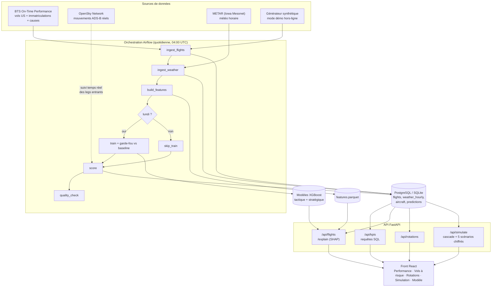
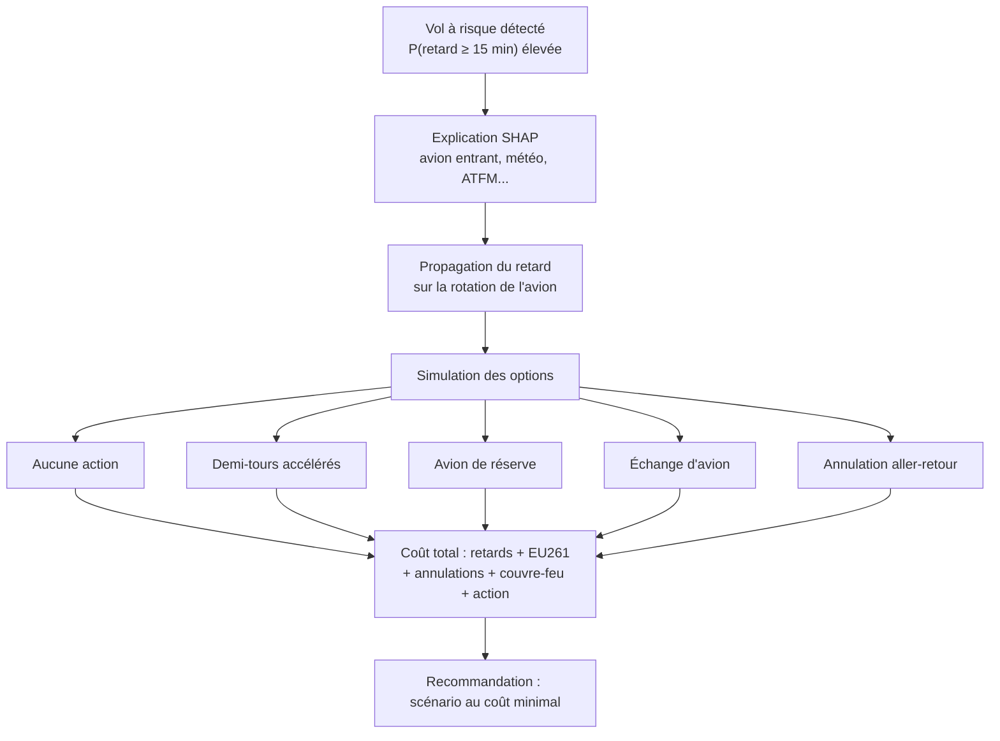

# Architecture

```mermaid
flowchart TD
    subgraph Sources["Sources de données"]
        BTS["BTS On-Time Performance<br/>vols US + immatriculations + causes"]
        OSN["OpenSky Network<br/>mouvements ADS-B réels"]
        IEM["METAR (Iowa Mesonet)<br/>météo horaire"]
        SYN["Générateur synthétique<br/>mode démo hors-ligne"]
    end

    subgraph Airflow["Orchestration Airflow (quotidienne, 04:00 UTC)"]
        I1["ingest_flights"] --> I2["ingest_weather"] --> FE["build_features"]
        FE --> BR{"lundi ?"}
        BR -->|oui| TR["train + garde-fou vs baseline"]
        BR -->|non| SK["skip_train"]
        TR --> SC["score"]
        SK --> SC
        SC --> QC["quality_check"]
    end

    BTS --> I1
    SYN --> I1
    IEM --> I2
    OSN -.->|"suivi temps réel<br/>des legs entrants"| SC

    DB[("PostgreSQL / SQLite<br/>flights, weather_hourly,<br/>aircraft, predictions")]
    I1 --> DB
    I2 --> DB
    FE --> PQ[("features.parquet")]
    TR --> MD[("Modèles XGBoost<br/>tactique + stratégique")]
    SC --> DB

    subgraph API["API FastAPI"]
        K["/api/kpis<br/>requêtes SQL"]
        P["/api/flights<br/>/explain (SHAP)"]
        R["/api/rotations"]
        S["/api/simulate<br/>cascade + 5 scénarios chiffrés"]
    end

    DB --> K
    DB --> P
    PQ --> P
    MD --> P
    DB --> R
    DB --> S

    UI["Front React<br/>Performance · Vols à risque · Rotations · Simulation · Modèle"]
    K --> UI
    P --> UI
    R --> UI
    S --> UI
```

## Flux de décision côté OCC

```mermaid
flowchart TD
    A["Vol à risque détecté<br/>P(retard ≥ 15 min) élevée"] --> B["Explication SHAP<br/>avion entrant, météo, ATFM..."]
    B --> C["Propagation du retard<br/>sur la rotation de l'avion"]
    C --> D["Simulation des options"]
    D --> D1["Aucune action"]
    D --> D2["Demi-tours accélérés"]
    D --> D3["Avion de réserve"]
    D --> D4["Échange d'avion"]
    D --> D5["Annulation aller-retour"]
    D1 --> E["Coût total : retards + EU261<br/>+ annulations + couvre-feu + action"]
    D2 --> E
    D3 --> E
    D4 --> E
    D5 --> E
    E --> F["Recommandation : scénario au coût minimal"]
```
